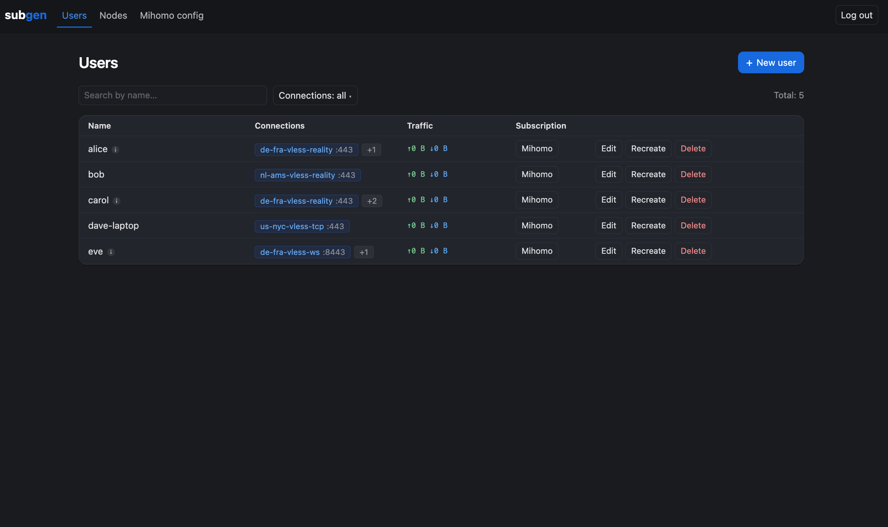
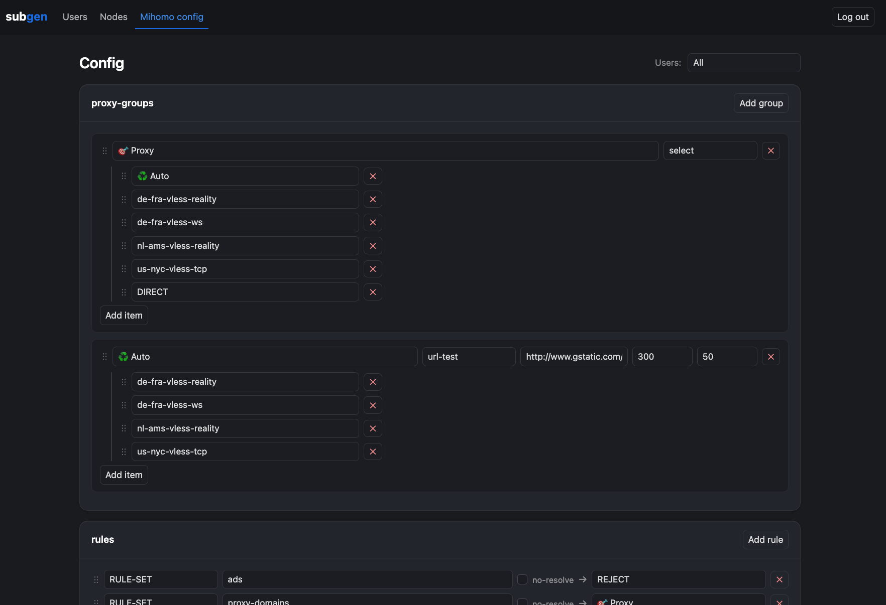
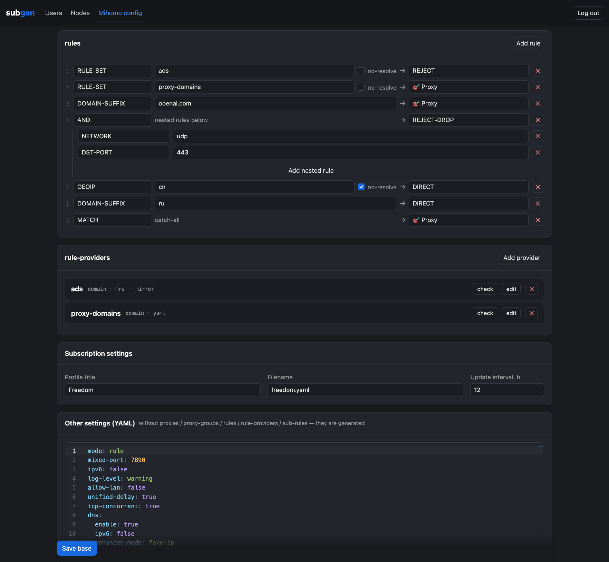
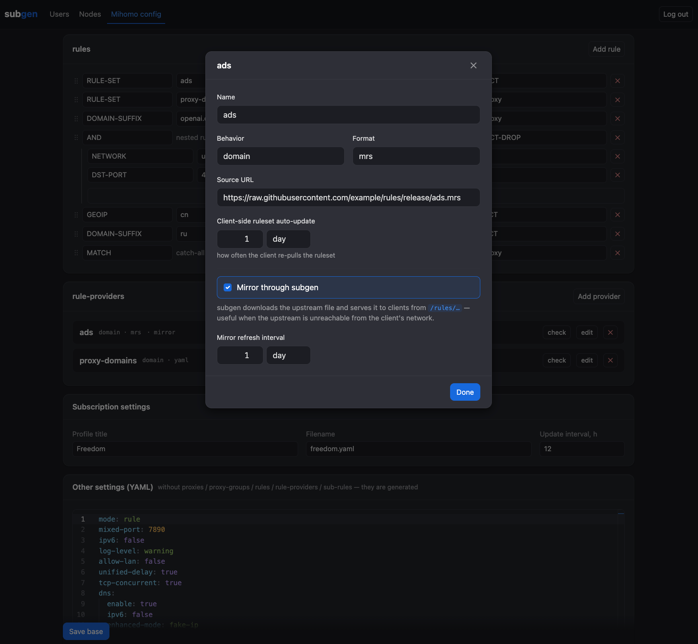
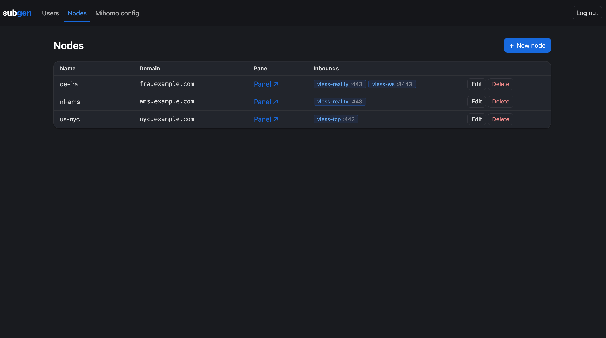
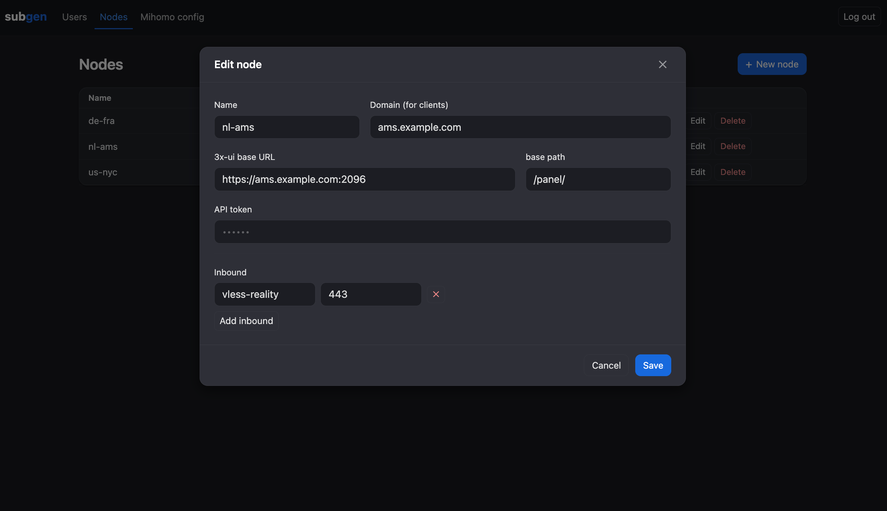
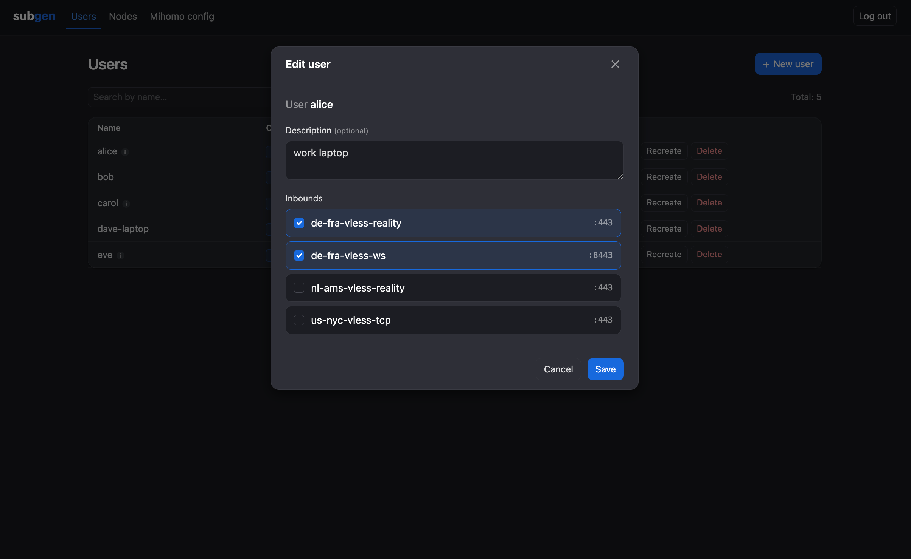

# subgen

**Self-hosted, per-client [mihomo](https://github.com/MetaCubeX/mihomo) (Clash.Meta) subscription server with a visual routing builder, on top of [3x-ui](https://github.com/MHSanaei/3x-ui).**

[](https://github.com/Postlog/subgen/actions/workflows/ci.yml)


subgen turns a fleet of [3x-ui](https://github.com/MHSanaei/3x-ui) panels into a proper
**Clash/mihomo subscription service**: it renders a full mihomo YAML config per subscriber
— with operator-defined **proxy-groups**, **routing rules** and **rule-providers** — and
serves it at `/sub/{kind}/{token}`. A small built-in admin panel manages nodes, users and
the routing config.



## What is it, and why?

3x-ui already ships a built-in Clash subscription, but it only emits a **flat `proxies`
list** — no proxy-groups, no rules, no rule-providers. That is not enough to express any
real routing UX (a connection switcher, ad-blocking, split-tunnel by region, QUIC drop,
RULE-SET providers, …).

subgen sits in front of your 3x-ui panels and fixes that:

- it reads your panels over the **3x-ui HTTP API** (Bearer token — no login/CSRF),
- lets you build a **rich mihomo config** visually (proxy-groups + rules + providers),
- and serves each subscriber a **complete, per-client mihomo YAML** at a tokenised URL.

It is meant for operators who run one or more 3x-ui nodes and want a single place to manage
users and a shared (or per-user) routing config — without hand-writing YAML per client.

> subgen is a standalone product spun out of the [`Postlog/vpn-toolchain`](https://github.com/Postlog/vpn-toolchain)
> monorepo. See [`docs/subgen.md`](docs/subgen.md) for the full design and operations guide.

## Features

- **Per-client mihomo/Clash.Meta config** rendered fresh per request and served at
  `/sub/{kind}/{token}` (`kind` = engine; `mihomo` today, designed for xray/sing-box later).
- **Visual routing builder** — operator-defined **proxy-groups** (`select` / `url-test` /
  `fallback` / `load-balance` / `relay`) and **routing rules**, both reorderable by
  drag-and-drop.
- **Typed references, no magic strings** — a rule target and a group member are the same
  typed `PolicyRef` (a built-in policy, an **inbound** by id, or another group); refs the
  subscriber can't reach are dropped at render time and the config stays referentially
  intact.
- **Logical rules (AND/OR/NOT)** with recursive nesting, edited as a tree.
- **Rule-providers** with optional **mirroring** — subgen fetches the upstream ruleset and
  re-serves it from `/rules/...`, so clients keep working when the upstream is unreachable.
- **Shared base + per-user custom configs** — every subscriber gets the shared base config;
  optionally clone it into an independent **per-user snapshot** and edit it freely.
- **3x-ui fleet management** — register nodes/panels, read inbounds over the Bearer API,
  one-click **user provisioning** onto all selected inbounds (one client / one uuid per
  panel, shared `subId`).
- **Tokenised subscription links** — `token = HMAC-SHA256(secret, subId)`; proxy UUIDs
  never appear in the URL.
- **Schema-driven admin UI** — the rule/group/policy/provider taxonomy comes from the
  backend; nothing is hardcoded in the frontend.
- **Single static binary** — embedded Vue 3 SPA (no build step), pure-Go SQLite
  (`modernc.org/sqlite`, CGO-free), shipped as a distroless Docker image.
- **Ordered DB migrations**, `slog` structured logging, table-driven unit tests +
  black-box API tests against real 3x-ui panels in CI.

## Screenshots

The admin panel is a dark Vue 3 SPA themed after 3x-ui v3 (Ant Design dark).

### Routing builder (Mihomo config)

Visual **proxy-groups** with typed members, drag-and-drop reorder:



**Routing rules** (including logical `AND`/`OR`/`NOT` with nested sub-rules), **rule-providers**, subscription profile, and the base-YAML editor:



A **rule-provider** with optional mirroring through subgen and a built-in URL/format check:



### Nodes

| Node registry | Add / edit a node |
| --- | --- |
|  |  |

### Users

| Users list & subscriptions | Assign a user's inbounds |
| --- | --- |
|  |  |

## How it works

```
node registry (SQLite)  +  3x-ui /panel/api/inbounds/list  ->  BuildFleet  ->  render mihomo YAML
        (Bearer token)                                                            |
client GET /sub/{kind}/{token} --(token=HMAC(secret,subId))-->  resolve subId  ---------+--> YAML + headers
```

- Panels (3x-ui >= 3.2) are read with `Authorization: Bearer <token>` — no login/CSRF.
- `settings` / `streamSettings` may be JSON objects (3.x) or strings (legacy); both handled.
- The fleet is built **fresh per request**; an unreachable panel is skipped, only a total
  outage errors.
- On a `/sub` request subgen resolves `token → subId → user`, picks the user's custom
  config for that engine (else the base), and renders it to YAML plus the subscription
  headers (`Profile-Update-Interval`, `Profile-Title`, `Subscription-Userinfo`, filename).
- Mirrored rule-providers are fetched in the background and served from `/rules/<name><ext>`.

## Quick start (local)

Requires **Go 1.25+**. No 3x-ui panel is needed to boot the admin UI and build a routing
config; you only need a panel to provision real users.

```sh
cp .env.example .env           # then set SUBGEN_SECRET (openssl rand -hex 32)
                               # and SUBGEN_ADMIN_PASSWORD; leave SUBGEN_TLS_* empty → plain HTTP
go run ./cmd/service           # reads ./.env, creates db/subgen.db, listens on 127.0.0.1:2097
```

Open <http://127.0.0.1:2097/admin> and sign in (`admin` / your `SUBGEN_ADMIN_PASSWORD`).
Add a node under **Nodes**, create a user under **Users**, then copy its subscription link.
The store lives in `db/` (gitignored) — delete it to start fresh.

Debug helpers:

```sh
go run ./cmd/subctl -dump-fleet        # print every subId, its token and proxies
go run ./cmd/subctl -print <subId>     # render one config to stdout
```

Node, user and routing-config edits take effect immediately — the next `/sub` request reads
the store live. The rule-provider **mirror** set is fixed at startup, so changing which
providers are mirrored needs a restart.

## Configuration

subgen splits config into two clean halves:

- **Bootstrap** (listener, TLS, secret, admin creds, db path) → **environment variables**,
  loaded from a local [`.env`](.env.example) file. Nothing secret in git.
- **Operational data** (nodes, proxy-groups, rules, rule-providers, base YAML, users,
  per-user custom configs) → the **SQLite store** (`db/subgen.db`), edited entirely through
  the admin panel. A fresh store starts **empty** — no defaults are seeded.

### Environment variables

| Variable | Required | Default | Purpose |
| --- | --- | --- | --- |
| `SUBGEN_SECRET` | **yes** | — | HMAC-SHA256 key for `/sub` tokens and admin sessions. `openssl rand -hex 32`. Rotating it invalidates every subscription link and logs admins out. |
| `SUBGEN_ADMIN_PASSWORD` | **yes** | — | Admin panel password (gates `/admin/api/*`). |
| `SUBGEN_ADMIN_USER` | no | `admin` | Admin login username. |
| `SUBGEN_LISTEN` | no | `0.0.0.0:2097` | HTTP(S) listen address. Use `127.0.0.1:2097` locally. |
| `SUBGEN_TLS_CERT` | no | — | TLS cert path. Set **both** cert+key for HTTPS, or leave **both** empty for plain HTTP. |
| `SUBGEN_TLS_KEY` | no | — | TLS private key path. |
| `SUBGEN_PUBLIC_BASE` | no | — | External base URL (scheme+host+port, no path) written into subscription links, e.g. `https://subgen.example.com:2097`. |
| `SUBGEN_DB_PATH` | no | `db/subgen.db` | SQLite path (relative to cwd); created if missing. |
| `SUBGEN_STATIC_DIR` | no | — | Serve the admin UI live from this on-disk dir instead of the embedded copy (local dev: edit + reload, no Go rebuild). Leave empty in production. |

Subscription-profile knobs (title, filename, update interval) are **not** env vars — they
are per-config settings edited in the admin **Mihomo config** tab.

## Docker

Production runs subgen as a **distroless, nonroot static** container (`Dockerfile`,
multi-stage). Run it locally with compose:

```sh
docker compose build                          # static binary → distroless image
mkdir -p db && sudo chown -R 65532:65532 db   # nonroot (uid 65532) writes the SQLite store
docker compose up -d                          # reads ./.env, persists ./db, listens on :2097
```

Set `SUBGEN_LISTEN=0.0.0.0:2097` in `.env`. For TLS, point `SUBGEN_TLS_CERT/KEY` under
`/certs` and mount the cert dir (see `docker-compose.yml`).

## Production deploy

Production deploy is a **manual GitHub Actions workflow**
([`.github/workflows/deploy.yml`](.github/workflows/deploy.yml)): tests gate the deploy,
the image is built on the runner, streamed to the server over SSH (`docker save | ssh |
docker load`), and run with `docker compose`. The `db/` bind-mount (panel tokens, nodes,
users) **persists across deploys**.

```sh
gh workflow run deploy.yml -f ref=main     # or: Actions → Deploy → Run workflow
```

The one-time GitHub Environment / server setup (secrets, deploy key, cert perms) is
documented in [`docs/subgen.md`](docs/subgen.md).

## Architecture

```
cmd/service/            composition root: load config, wire services, ogen server + static, TLS, shutdown
cmd/subctl/             CLI utility: -dump-fleet / -print <subId>
migrations/0001-init.sql baseline schema (first migration; embedded)
migrations/NNNN-*.sql    ordered migrations, run in filename order by migrations.Apply on open
internal/entity/        kernel domain types + sentinel errors (User, Node, Inbound, Fleet, Subscriber, Proxy, …)
internal/mihomo/        mihomo-config subdomain: schema (RoutingRule, ProxyGroup, PolicyRef, RuleProvider) + decode/validate
internal/mihomo/render/ mihomo YAML generation (proxies, proxy-groups, rules; per-subscriber PolicyRef resolver)
internal/config/        .env bootstrap load (env tags) + validation
internal/clients/xui/   3x-ui API client (stateless; panel passed per call; one method per file)
internal/repository/    SQLite: Open() -> *sql.DB; users/ nodes/ routing/ configs/ (per-entity, one method per file)
internal/service/       fleet (fetch panels + BuildFleet + TTL cache) / ruleset (mirror) / provisioning (user CRUD + panel reconcile)
internal/oas/           ogen-generated typed server from openapi/
internal/handlers/<action>/  one package per HTTP action (contract.go + handler.go)
internal/handlers/api/  thin composite: forwards each ogen operation to its handler; SecurityHandler + ErrorHandler
internal/handlers/web/  shared HTTP kit + the embedded Vue 3 SPA (static/)
internal/cert/          TLS cert reloader (reloads on file change)
internal/token/         HMAC sub tokens
```

The HTTP layer is **ogen-generated from the OpenAPI spec** (`openapi/` → `internal/oas`),
mounted at `/` on a stdlib `http.ServeMux`; the only side route is `/admin/static/*` for
assets. There is no `App` oracle — dependencies flow bottom-up
(`repository`/`clients` → `service` → `handler`), wired in `cmd/service`.

## Documentation

- [`docs/subgen.md`](docs/subgen.md) — design rationale, operations, admin-panel tour, deploy.
- [`AGENTS.md`](AGENTS.md) — code style & conventions (layers, contracts, testing, errors).
- [`openspec/`](openspec) — the living spec baseline (`specs/`) and the OpenSpec change workflow
  (it replaces the former ADR catalog).
- [`CHANGELOG.md`](CHANGELOG.md) — one entry per PR.
- [`openapi/`](openapi) — the HTTP contract (source of the generated server).
- [`apitest/README.md`](apitest/README.md) — black-box API tests against real 3x-ui.

## Contributing

Contributions are welcome — see [`CONTRIBUTING.md`](CONTRIBUTING.md) for the dev setup,
how to run the tests/lint and code generation, and the project conventions (start with
[`AGENTS.md`](AGENTS.md)).

## License

[MIT](LICENSE) © postlog
